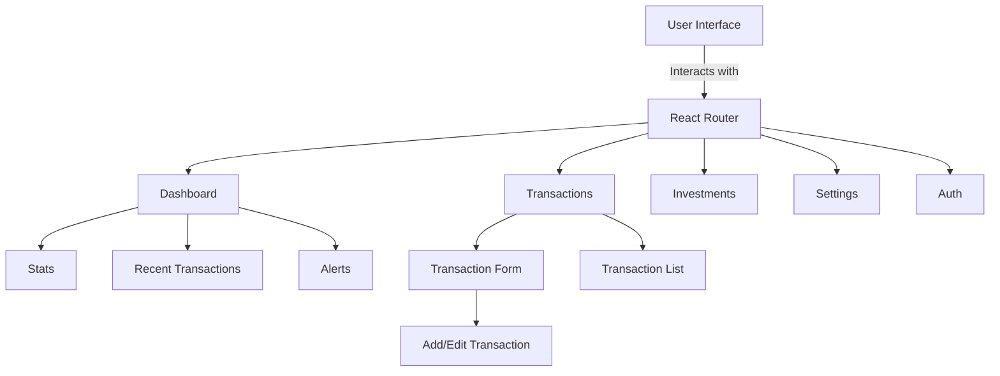

# Deepcash

## Why Deepcash?

In today's fast-paced financial world, keeping track of your money shouldn't be a hassle. Deepcash is a modern, intuitive personal finance management application designed to give you complete control over your financial life. Whether you're saving for a goal, managing daily expenses, or growing your investments, Deepcash provides the tools you need to make informed financial decisions.

### Key Benefits

- **Financial Clarity**: Get a clear, real-time view of your financial health through intuitive dashboards and reports
- **Smart Insights**: Understand your spending patterns with AI-powered analytics and trend analysis
- **Goal Tracking**: Set and monitor financial goals with visual progress tracking
- **Secure & Private**: Your financial data is protected with industry-standard encryption and security measures

## Features

### 1. Comprehensive Dashboard
- **Real-time Overview**: Monitor your total balance, monthly expenses, and income at a glance
- **Interactive Charts**: Visualize your financial trends with dynamic Chart.js visualizations
- **Smart Alerts**: Receive notifications about unusual spending patterns or achieved goals
- **Dark Mode Support**: Comfortable viewing experience in any lighting condition

### 2. Transaction Management
- **Easy Entry**: Quick and intuitive transaction input with categorization
- **Bulk Operations**: Efficiently manage multiple transactions at once
- **Smart Categories**: Automatic categorization of recurring transactions
- **Search & Filter**: Find specific transactions with powerful filtering options

### 3. Investment Tracking
- **Portfolio Overview**: Track your investment performance across different assets
- **Performance Metrics**: Monitor ROI, gains/losses, and portfolio distribution
- **Market Integration**: Stay updated with market trends and performance

### 4. Technical Stack

Deepcash is built with modern, reliable technologies:

- **Frontend**: React 18 with TypeScript for type-safe, maintainable code
- **State Management**: Zustand for efficient, scalable state management
- **Data Validation**: Zod for runtime type checking and validation
- **UI Framework**: Tailwind CSS for responsive, customizable design
- **Backend Integration**: Supabase for secure, scalable data storage
- **Visualization**: Chart.js with react-chartjs-2 for dynamic financial charts

## Installation

1. Clone the repository:
   ```bash
   git clone https://github.com/yourusername/deepcash.git
   ```
2. Navigate into the project directory:
   ```bash
   cd deepcash
   ```
3. Install the dependencies:
   ```bash
   npm install
   ```

## Usage

### Development
```bash
npm run dev
```
This starts the development server with hot-reload enabled. Perfect for development and testing.

### Production Build
```bash
npm run build
```
Creates an optimized production build with:
- Minified assets
- Tree-shaking for smaller bundle size
- Optimized performance

### Preview Production
```bash
npm run preview
```
Preview the production build locally before deployment.

## Architecture



## Dependencies

### Core Dependencies
- **React**: ^18.3.1 - Modern UI development
- **React Router**: ^6.22.2 - Application routing
- **Chart.js**: ^4.4.1 - Financial data visualization
- **Tailwind CSS**: ^3.4.1 - Utility-first CSS framework
- **Supabase**: ^2.39.7 - Backend as a Service
- **Zustand**: ^4.5.1 - State management
- **Zod**: ^3.22.4 - Schema validation

### Development Tools
- **TypeScript**: ^5.5.3
- **Vite**: ^5.4.2
- **ESLint**: ^9.9.1
- **PostCSS**: ^8.4.35

## Contributing

We welcome contributions! Please see our contributing guidelines for details on how to:
- Submit bug reports
- Request features
- Submit pull requests

## License

This project is licensed under the MIT License - see the LICENSE file for details.

## Support

Need help? Check out our:
- Documentation
- Discord community
- GitHub issues

## Roadmap

- [ ] Mobile application
- [ ] Budget planning features
- [ ] Bill payment reminders
- [ ] Multi-currency support
- [ ] Financial goal templates
